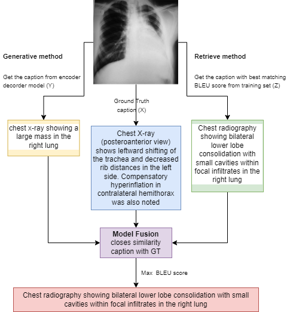

# image-captioning
The aim of the project is to create a captioning model. The architecture of your generative model which  have two encoders and a decoder. The first encoder is used to extract visual features from images, while the second one is used for semantic features. Visual and semantic features are then concatenated to represent the  images.The decoder aims at generating words to construct the captions for the medical images.

## methodology 

We employed both generative and retrieval models to produce the output captions. Within the generative approach, two methodologies were utilized:

1. A dual-encoder configuration involving one image encoder and a separate text encoder for captions, both linked to a decoder.
2. A single encoder-decoder setup.

The outputs from the chosen encoder configuration were then fed into the decoder to generate provisional captions. These were subsequently compared with the captions obtained from the retrieval model to determine the final caption.

    

# Usage 

1. Install the requirements

       pip3 install -r requirements.txt

2. scripts 
   
        process_dataset.ipynb             Task1: select dataset and generate the json dat object
        data_visualize.ipynb              Task1: visualize samples from the dataset
        vocabulary_builder.ipynb          Task2: build the vocabulary 
        vacabulary_frequency.ipynb        Task3: plot the word occurrences 
        word_embeddings.ipynb             Task4: generate word embeddings (using different methods) and plotting 
        data_loader.ipynb                 Task5: pytorch data loading functions generative model (encoder-decoder models)
        train_duel_encoder.ipynb          Task5: fit data: model training of duel encoder model
        train_single_encoder.ipynb        Task5: fit data: model training of single encoder model
        similarity_single_encoder.ipynb   Task6 - Task9 using single encoder generative model 
                                          Task6: get generative captions and similarities with GTs (X) using different similarity matrices 
                                          Task7: Retrieval method: get the most similar caption for generated caption (Y) from training set (Z)
                                          Task8: model fusion: compare GT (X) with (Y) and (Z) and get the best caption as (Y) or (Z) and assigned it to test image
                                          Task9: Evaluation metrics
        similarity_duel_encoder.ipynb     Task6 - Task9 using dual encoder generative model 
        inference.ipynb                   Task6 - inference of dual encoder model
        